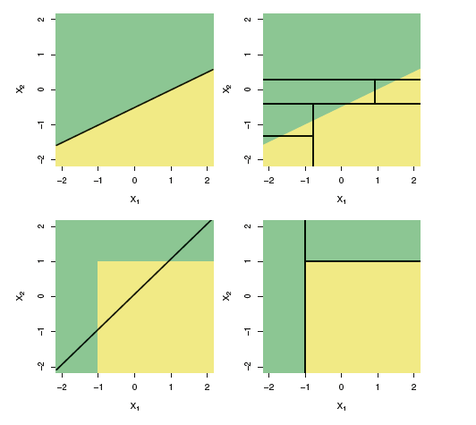

## Bootstrapping

<style>
em {
  font-style: italic
}
</style>
<style>
strong {
  font-weight: bold;
}
</style>

> * Inferential statistics: Estimating parameters of a population.
> * However, almost *always* we only have a *single sample*.
> * True error in a sample statistic against its population value is unknowable.
> * We end up making assumptions about the *shape/distribution* of the population.

.build _Is there an alternative?_

> - Consider the sample as your population. *Resample with replacement.*

---

<iframe width="400" height="225" frameborder="0"
  src="boot.iid.html" >
</iframe>

---

## Decision Trees

* Given a response variable and predictors, a set of rules governing the behavior of response variables depending on the split of predictors.

* Can be applied to both regression and classification problems.

* CART - Classification and Regression Trees

#### Algorithm:
- Divide predictor space into distinct non-overlapping regions.

- For *regression*, make same prediction (= mean of response values) for all observations falling into the region.
- For *classification*, make prediction based of majority votes of observation class.

--- &twocol
## Regression Trees: Splitting up the predictor space

*** =left
```{r tree_plot, echo=FALSE, eval=TRUE}
library(ISLR); library(tree) ; library(MASS)
set.seed (1) 
train <- sample (1: nrow(Boston), nrow(Boston )/2)
tree.boston <- tree(medv~lstat+age, Boston, subset=train)
tree.boston <- prune.tree(tree.boston ,best =5)
plot(tree.boston)
text(tree.boston ,pretty =0)
```
*** =right
```{r split_tree, echo=FALSE, eval=TRUE}
library(ISLR); library(ggplot2) ; library(MASS)
set.seed (1) 
train <- sample (1: nrow(Boston), nrow(Boston )/2)
ggplot(data=Boston,aes(age, lstat),subset=train)+geom_point()+
  geom_hline(yintercept = 9.715)+geom_hline(yintercept = 4.475)+
  geom_segment(aes(x=88.75,y=0,xend=88.75,yend=4.475))+coord_cartesian(ylim=c(0,40))
```

--- &twocol
## Classification Trees: Splitting up the predictor space
*** =left
```{r class_tree_plot_115, echo=FALSE, eval=TRUE}
library(tree)
library(ISLR)
data(Carseats)
CC <- Carseats
CC$HighS <- ifelse(CC$Sales<=8,"No","Yes")
tree.carseats <- tree(factor(HighS)~Price+factor(ShelveLoc)-Sales,data=CC)
tree.carseats <- prune.misclass(tree.carseats, best =3)
plot(tree.carseats)
text(tree.carseats, pretty =0)
```
*** =right
```{r class_split_11, echo=FALSE, eval=TRUE}
library(ISLR); library(ggplot2)
data(Carseats)
CC <- Carseats
CC$High <- ifelse(CC$Sales <=8," No","Yes")
ggplot(data=CC,aes(factor(ShelveLoc), Price))+
  geom_point(aes(color=(High)))+
  geom_hline(yintercept=92.5)
```

---
## Trees versus Linear Models

<div class="footer" style="margin-left:400px;margin-top:10px;font-size:80%;">
Source: James, G.; Witten, D.; Hastie, T.; Tibshirani, R.: An Introduction to Statistical Learning: Springer Texts in Statistics<br>
<br>
</div>

---

## Pros and Cons of Decision Trees

#### Pros:
- High explainability, mirror human decision-making.
- Can handle qualitative predictors without dummies.

#### Cons:
- Tends to overfit the training set (way-out: prunning). *Low Bias but High Variance*
- Generally, do not have the same level of prediction accuracy compared to other models on validation set. 

.build However, aggregating trees along with bootstrapping can lead to significant improvement in prediction accuracy.

--- #kaggle

## Random Forest

> * Take bootstrapped samples from training data >> Randomly sample $m$ predictors >> fit decision trees >> Average out results of these tress.

> * Rationale: If there exists a strong predictor, along with moderately strong predictors, trees become correlated. Averaging out results does not lead to reduction in variance.

> * The datasets left out of the $b^{th}$ bootstrapped samples: "Out-of-Bag observations"

> * Predictions for $i^{th}$ observation for which it was OOB.
Average of predicted responses (for regression) or majority vote (for classification).

> * OOB Error also acts as a proxy for test set validation.

> * Trade-off loss of interpratibility with high-performance.

--- #examples

```{r rf1, echo=TRUE, eval=TRUE, warning=FALSE, tidy=FALSE, results='markup', message=FALSE, strip.white=TRUE, collapse=TRUE, size = "tiny", comment=""}
library(MASS); data(fgl); summary(fgl)
```

---

```{r rf2, echo=TRUE, eval=TRUE, warning=FALSE, tidy=FALSE, results='markup', message=FALSE, strip.white=TRUE, collapse=FALSE, size = "tiny", comment=""}
library(randomForest)
mod <- randomForest(type~., data=fgl, mtry=3, importance=TRUE)
print(mod)
```

---
```{r rf3, echo=TRUE, eval=TRUE, warning=FALSE, tidy=FALSE, results='markup', message=FALSE, strip.white=TRUE, collapse=FALSE, size = "tiny", comment="", fig.align='center'}
varImpPlot(mod)
```
