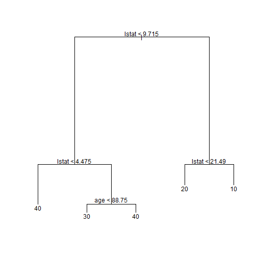
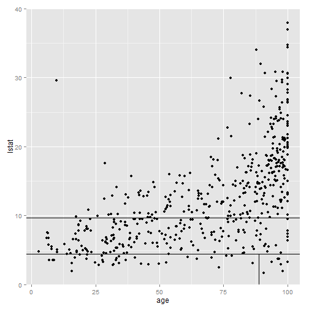
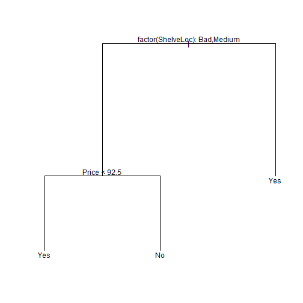
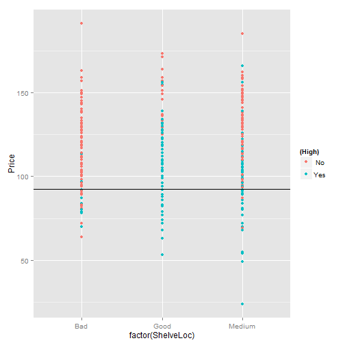
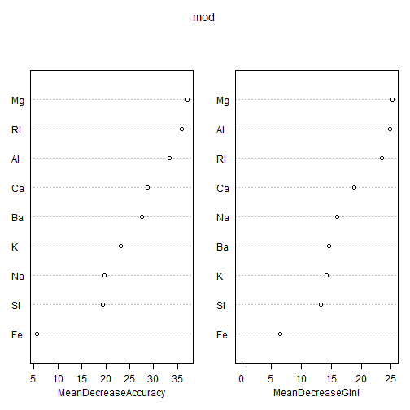

## Bootstrapping

<style>
em {
  font-style: italic
}
</style>
<style>
strong {
  font-weight: bold;
}
</style>

> * Inferential statistics: Estimating parameters of a population.
> * However, almost *always* we only have a *single sample*.
> * True error in a sample statistic against its population value is unknowable.
> * We end up making assumptions about the *shape/distribution* of the population.

.build _Is there an alternative?_

> - Consider the sample as your population. *Resample with replacement.*

---

<iframe width="400" height="225" frameborder="0"
  src="boot.iid.html" >
</iframe>

---

## Decision Trees

* Given a response variable and predictors, a set of rules governing the behavior of response variables depending on the split of predictors.

* Can be applied to both regression and classification problems.

* CART - Classification and Regression Trees

#### Algorithm:
- Divide predictor space into distinct non-overlapping regions.

- For *regression*, make same prediction (= mean of response values) for all observations falling into the region.
- For *classification*, make prediction based of majority votes of observation class.

--- &twocol
## Regression Trees: Splitting up the predictor space

*** =left
 
*** =right
 

--- &twocol
## Classification Trees: Splitting up the predictor space
*** =left
 
*** =right
 

---
## Trees versus Linear Models

<div class="footer" style="margin-left:400px;margin-top:10px;font-size:80%;">
Source: James, G.; Witten, D.; Hastie, T.; Tibshirani, R.: An Introduction to Statistical Learning: Springer Texts in Statistics<br>
<br>
</div>

---

## Pros and Cons of Decision Trees

#### Pros:
- High explainability, mirror human decision-making.
- Can handle qualitative predictors without dummies.

#### Cons:
- Tends to overfit the training set (way-out: prunning). *Low Bias but High Variance*
- Generally, do not have the same level of prediction accuracy compared to other models on validation set. 

.build However, aggregating trees along with bootstrapping can lead to significant improvement in prediction accuracy.

--- #kaggle

## Random Forest

> * Take bootstrapped samples from training data >> Randomly sample $m$ predictors >> fit decision trees >> Average out results of these tress.

> * Rationale: If there exists a strong predictor, along with moderately strong predictors, trees become correlated. Averaging out results does not lead to reduction in variance.

> * The datasets left out of the $b^{th}$ bootstrapped samples: "Out-of-Bag observations"

> * Predictions for $i^{th}$ observation for which it was OOB.
Average of predicted responses (for regression) or majority vote (for classification).

> * OOB Error also acts as a proxy for test set validation.

> * Trade-off loss of interpratibility with high-performance.

--- #examples


```r
library(MASS); data(fgl); summary(fgl)
       RI                Na              Mg              Al       
 Min.   :-6.8500   Min.   :10.73   Min.   :0.000   Min.   :0.290  
 1st Qu.:-1.4775   1st Qu.:12.91   1st Qu.:2.115   1st Qu.:1.190  
 Median :-0.3200   Median :13.30   Median :3.480   Median :1.360  
 Mean   : 0.3654   Mean   :13.41   Mean   :2.685   Mean   :1.445  
 3rd Qu.: 1.1575   3rd Qu.:13.82   3rd Qu.:3.600   3rd Qu.:1.630  
 Max.   :15.9300   Max.   :17.38   Max.   :4.490   Max.   :3.500  
       Si              K                Ca               Ba       
 Min.   :69.81   Min.   :0.0000   Min.   : 5.430   Min.   :0.000  
 1st Qu.:72.28   1st Qu.:0.1225   1st Qu.: 8.240   1st Qu.:0.000  
 Median :72.79   Median :0.5550   Median : 8.600   Median :0.000  
 Mean   :72.65   Mean   :0.4971   Mean   : 8.957   Mean   :0.175  
 3rd Qu.:73.09   3rd Qu.:0.6100   3rd Qu.: 9.172   3rd Qu.:0.000  
 Max.   :75.41   Max.   :6.2100   Max.   :16.190   Max.   :3.150  
       Fe             type   
 Min.   :0.00000   WinF :70  
 1st Qu.:0.00000   WinNF:76  
 Median :0.00000   Veh  :17  
 Mean   :0.05701   Con  :13  
 3rd Qu.:0.10000   Tabl : 9  
 Max.   :0.51000   Head :29  
```

---


```r
library(randomForest)
mod <- randomForest(type~., data=fgl, mtry=3, importance=TRUE)
print(mod)
```

```

Call:
 randomForest(formula = type ~ ., data = fgl, mtry = 3, importance = TRUE) 
               Type of random forest: classification
                     Number of trees: 500
No. of variables tried at each split: 3

        OOB estimate of  error rate: 19.63%
Confusion matrix:
      WinF WinNF Veh Con Tabl Head class.error
WinF    62     6   2   0    0    0   0.1142857
WinNF   10    62   1   1    1    1   0.1842105
Veh      7     3   7   0    0    0   0.5882353
Con      0     3   0   9    0    1   0.3076923
Tabl     0     2   0   0    7    0   0.2222222
Head     1     3   0   0    0   25   0.1379310
```

---

```r
varImpPlot(mod)
```


