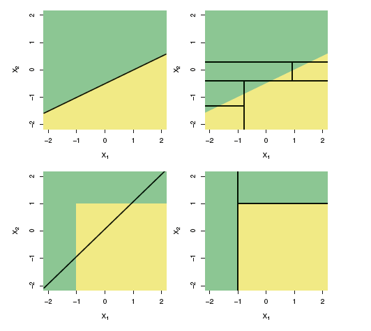

## Bootstrapping

<style>
em {
  font-style: italic
}
</style>
<style>
strong {
  font-weight: bold;
}
</style>

> * Inferential statistics: Estimating parameters of a population.
> * However, almost *always* we only have a *single sample*.
> * True error in a sample statistic against its population value is unknowable.
> * We end up making assumptions about the *shape/distribution* of the population.

.build _Is there an alternative?_

> - Consider the sample as your population. *Resample with replacement.*

---

<iframe width="400" height="225" frameborder="0"
  src="boot.iid.html" >
</iframe>

---

## Decision Trees

* Given a response variable and predictors, a set of rules governing the behavior of response variables depending on the split of predictors.

* Can be applied to both regression and classification problems.

* CART - Classification and Regression Trees

#### Algorithm:
- Divide predictor space into distinct non-overlapping regions.

- For *regression*, make same prediction (= mean of response values) for all observations falling into the region.
- For *classification*, make prediction based of majority votes of observation class.

--- &twocol
## Regression Trees: Splitting up the predictor space

*** =left
 
*** =right
 

--- &twocol
## Classification Trees: Splitting up the predictor space
*** =left
 
*** =right
 

```
## RStudioGD 
##         2
```

 

---

## Trees versus Linear Models

<div class="footer" style="margin-left:400px;margin-top:10px;font-size:80%;">
Source: James, G.; Witten, D.; Hastie, T.; Tibshirani, R.: An Introduction to Statistical Learning: Springer Texts in Statistics<br>
<br>
</div>

---

## Pros and Cons of Decision Trees

#### Pros:
- High explainability, mirror human decision-making.
- Can handle qualitative predictors without dummies.

#### Cons:
- Tends to overfit the training set (way-out: prunning). *Low Bias but High Variance*
- Generally, do not have the same level of prediction accuracy compared to other models on validation set. 

.build However, aggregating trees along with bootstrapping can lead to significant improvement in prediction accuracy.

--- #kaggle

## Random Forest

> * __BootStrap Aggregation__: Take bootstrapped samples from training data >> Randomly sample $m$ predictors >> fit decision trees >> Average out results of these tress.

> * Rationale: If there exists a strong predictor, along with moderately strong predictors, trees become correlated. Averaging out results does not lead to reduction in variance.

> * The datasets left out of the $b^{th}$ bootstrapped samples: "Out-of-Bag observations"

> * Predictions for $i^{th}$ observation for which it was OOB.
Average of predicted responses (for regression) or majority vote (for classification).

> * OOB Error also acts as a proxy for test set validation.

> * Trade-off loss of interpratibility with high-performance.

> * Has single-handedly won 4 Kaggle Competitions.

---

## Pizza Hut Data Science Competition

#### Objective
- Predict probability of buying pizza, wings, others (visit). Profiling of wing buyers.
- Segment customers based on propensity to buy to wings to recommend actionability (target marketing campaigns) at a zip code level.
- Detemine right offers for a customer.

#### Methodology
- RFM Segmentation
- Multinomial logistic regression
- Random Forest
- Collaborative filtering
